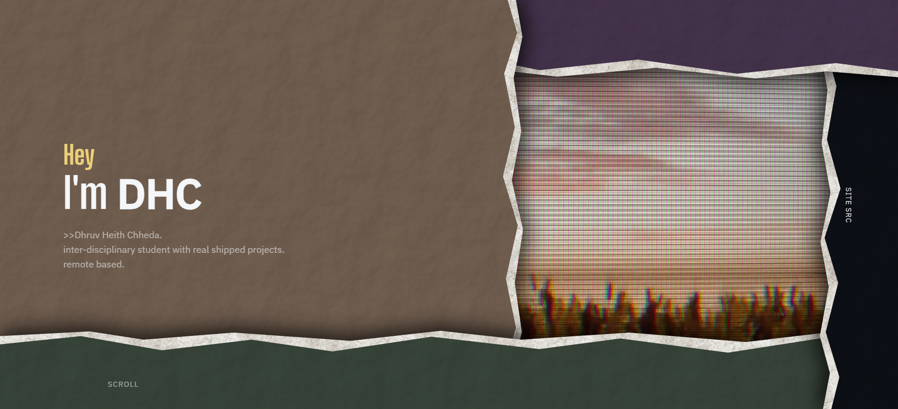

# heith.me

Personal portfolio site. Built with vanilla HTML, CSS, and JavaScript. No frameworks, no build tools, and only a couple of external dependencies for fonts and smooth scrolling. Use browser with hardware acceleration for all aesthetics, it will still work on any device. 

  

## Why I Built It This Way

I wanted the site itself to be part of the work I was showing. So the animations, layout, video syncing, performance checks and the little browser-specific things all live in the project.

This also meant I had to deal with all the small problems that come with putting all of those things together. That ended up being a big part of the project.

The portfolio is also one of the pieces in the portfolio. It is the site I built to put the rest of my work, process and projects together for university applications.

## What It Does

The landing page is made from overlapping paper panels with torn edges and noise textures, with a looping video underneath. As you scroll, the panels peel back and reveal more of the CRT footage underneath.

The Design, Devlogs and Projects links sit directly over the video using `mix-blend-mode: difference`. Since the video is constantly changing, the text colour changes with it. A sync script reads the current video colour and works backwards to find the CSS colour the text needs.

The right panel is `#0D1117`, the same dark background GitHub uses. Clicking "site src" expands the panel and takes you to the repository, with the same colour carrying through.

Design, Devlogs and Projects each have their own colour palette. They still share the same navbar, CRT layer and device checks.

### Capability Detection

A synchronous script (`system-check.js`) runs in `<head>` before the first paint. It checks WebGL for GPU renderer strings, then checks device memory, core count and the browser's `saveData` setting.

From those checks, the site picks one of three modes:

* **High-perf**: A real GPU is confirmed. Full CRT scanlines, animated refresh sweep and the full video reel are enabled.

* **Compat**: The GPU can't be verified or a software renderer is reported. The site uses the lighter version with a static vignette.

* **Lite**: The device looks too weak or `saveData` is enabled. CRT effects are removed, the theme is flattened and the smaller video file is used.

The check is pretty basic and there are probably edge cases it gets wrong. When it can't tell what the device can handle, it picks the lighter option.

### The Custom Cursor

The cursor is a blob that replaces the normal pointer. It trails behind the mouse with some lag and stretches in the direction it is moving based on its velocity.

The cursor behaviour is adapted from [Xenobiota](https://xenobiota.vercel.app/) by tol-is. The [source](https://github.com/tol-is/xenobiota) is here. I only use the cursor blob behaviour. The full creature system is not part of this site.

### The Favicon

The browser tab starts blank using an inline 1×1 transparent GIF.

During the loading screen, a glass-like favicon appears, moves upward and lands in the browser tab slot. I liked the idea of having something move from the page into the browser itself.

## Things I Looked At

* [xenobiota.vercel.app](https://xenobiota.vercel.app/) by tol-is: cursor blob

* [rithunyaa.github.io](https://rithunyaa.github.io/personal_website2/): layout and presentation

* [pxlin.space](https://pxlin.space/): interaction design

* [sandeep.ramgolam.com](https://sandeep.ramgolam.com/): portfolio structure

* [acid-crunch.com](https://acid-crunch.com/): CRT effects and visual style

* [artemartemartem.com](https://artemartemartem.com/): typography and the video reveal idea

## Other Projects

The site links to a few other things I've made:

* **This Alien Doesn't Exist**: Procedural creature generator using Mulberry32 and the Canvas API

* **VoyagerOS**: Retro-futuristic browser OS for a fictional deep-space probe

* **Obscure**: Minimal new-tab homepage for searching across independent search engines

* **Seven Minute Shadow**: WarioWare-style minigame collection demo built in Godot

## Stack

* HTML5 / CSS3 / Vanilla JavaScript

* [Big Shoulders Display](https://fonts.google.com/specimen/Big+Shoulders+Display) + [IBM Plex Sans](https://fonts.google.com/specimen/IBM+Plex+Sans)

* [Lenis](https://github.com/darkroomengineering/lenis) for smooth scrolling

* GitHub Pages

## License

MIT